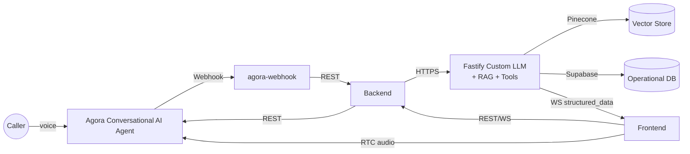

# SmartSense Customer Support Agent

AI-first customer support stack where a React console, an Agora Conversational AI voice agent, and a Fastify-based custom LLM work together to resolve customer requests with RAG, SQL tools, and live structured data.

- 🗣️ **Realtime voice** – the frontend joins the same RTC channel as Agora’s agent and lets operators monitor/mute/end calls.
- 🧠 **Custom LLM layer** – Fastify service augments the agent with Pinecone-backed RAG, Supabase-aware SQL tools, and emits structured JSON over WebSockets.
- 🧩 **Workflow brain** – Node/Express backend orchestrates Agora agent sessions, builds customer-aware system prompts, tracks intents/sentiment, and can trigger escalations/email.
- 🛰️ **Webhooks & automations** – optional listener watches Agora events for `[ESCALATE_REQUIRED]` / `[BOT_UPDATE]` markers and forwards them to backend APIs.

## Architecture



## Repository layout

| Path | Description |
| --- | --- |
| `smart-support-frontend/` | React console that joins Agora RTC, starts/stops AI sessions, and renders structured insights streamed from the LLM service. |
| `smart-support-backend/` | Express API that provisions Agora agents, builds RAG/system prompts, seeds mock data, logs events, and exposes automation utilities. |
| `agora-convo-ai-custom-llm-fastify/` | Fastify service that Agora calls as a custom LLM. Handles OpenAI calls, RAG (Pinecone), Supabase tools, websocket streaming, and tool->Agora RTM actions. |
| `agora-webhook/` | Lightweight Express webhook that receives Agora lifecycle events, detects escalation/update tags, and forwards them to backend endpoints. |

## Prerequisites

- Node.js v18+ and npm
- Agora account with Conversational AI project, RTC App ID, App Certificate, Customer ID/Secret
- OpenAI API key (GPT-4o / GPT-4o mini for LLM + embeddings)
- Pinecone project (serverless index for `text-embedding-3-small`)
- Supabase project (run `smart-support-backend/SUPABASE_SCHEMA.sql` to create tables)
- Optional: SMTP credentials for escalation emails & ngrok/public URL so Agora can reach local services

## Environment variables

Create `.env` files inside each package (values below are representative).

### `smart-support-backend/.env`

```bash
PORT=4000
AGORA_APP_ID=your_agora_app_id
AGORA_APP_CERTIFICATE=your_agora_app_certificate
AGORA_CUSTOMER_ID=your_customer_id
AGORA_CUSTOMER_SECRET=your_customer_secret
OPENAI_API_KEY=sk-...
PINECONE_API_KEY=pc-...
PINECONE_INDEX_NAME=smart-support-kb
SUPABASE_URL=https://xxxxxxxx.supabase.co
SUPABASE_SERVICE_ROLE_KEY=service_role_key
SMTP_HOST=smtp.gmail.com
SMTP_PORT=587
SMTP_USER=bot@yourdomain.com
SMTP_PASS=app_password
```

> The backend currently points to a hard-coded LLM URL inside `smart-support-backend/server.js` lines 410-430. Replace that `llm.url` with the public URL for the Fastify custom LLM (ngrok tunnel or deployed host) before running.

### `agora-convo-ai-custom-llm-fastify/.env`

```bash
PORT=3005
AGORA_APP_ID=your_agora_app_id
AGORA_APP_CERTIFICATE=your_agora_app_certificate
AGORA_CUSTOMER_ID=your_customer_id
AGORA_CUSTOMER_SECRET=your_customer_secret
OPENAI_API_KEY=sk-...
OPENAI_MODEL=gpt-4o-mini
OPENAI_EMBEDDING_MODEL=text-embedding-3-small
USE_RESPONSES_API=false
PINECONE_API_KEY=pc-...
PINECONE_INDEX=smart-support-kb
PINECONE_NAMESPACE=smartsense
SUPABASE_URL=https://xxxxxxxx.supabase.co
SUPABASE_SERVICE_ROLE_KEY=service_role_key
SUPPORT_TICKETS_TABLE=support_tickets
SUPPORT_INTERACTIONS_TABLE=support_interactions
SUPPORT_EMAIL=info@optivisx.com
SMTP_HOST=smtp.gmail.com
SMTP_PORT=587
SMTP_USER=bot@yourdomain.com
SMTP_PASS=app_password
AGENT_ID=agent_id_from_agora_console
```

### `agora-webhook/.env`

```bash
PORT=4001
BACKEND_BASE_URL=http://localhost:4000
```

### `smart-support-frontend/.env`

```bash
REACT_APP_WS_URL=ws://localhost:3005/ws/structured-data
```

> Axios calls in `src/App.js` default to `http://localhost:4000`. Update those URLs or introduce `REACT_APP_API_BASE` if you deploy elsewhere.

## Setup & installation

1. **Install dependencies**
   ```bash
   npm install --prefix smart-support-frontend
   npm install --prefix smart-support-backend
   npm install --prefix agora-convo-ai-custom-llm-fastify
   npm install --prefix agora-webhook
   ```
2. **Configure Supabase**
   - Run `smart-support-backend/SUPABASE_SCHEMA.sql` inside the Supabase SQL editor.
   - Set up service role key and optionally seed customer/order rows using the backend’s data service.
3. **Provision Pinecone**
   - Create a serverless index (dimension 1536, cosine) and record `PINECONE_INDEX`.
4. **Expose local services (if Agora needs access)**
   - Use `ngrok http 3005` for the custom LLM service and `ngrok http 4000` for the backend, then copy HTTPS URLs into Agora console and `llm.url`.

## Component guides

### 1. Custom LLM service (`agora-convo-ai-custom-llm-fastify`)

- Handles `/v1/chat/completion` for Agora. Adds RAG context (`src/services/ragService.ts`), OpenAI tool calls (`src/libs/toolDefinitions.ts`), Supabase-backed ticket/order helpers (`src/libs/tools.ts`), and emits structured JSON via `ws://host/ws/structured-data`.
- Commands:
  ```bash
  cd agora-convo-ai-custom-llm-fastify
  npm run dev        # watch mode with nodemon
  npm run build      # compile TypeScript
  npm start          # run built JS (dist/server.js)
  ```
- Health check: `curl http://localhost:3005/ping`.
- Structured data: anything the LLM outputs with a trailing JSON block will be parsed by `structuredDataUtils` and broadcast to WebSocket subscribers (the React dashboard listens here).
- Tools: functions map to Supabase writes plus Agora RTM messages. Grant the Supabase service role key and ensure tables (`support_tickets`, `support_interactions`, etc.) exist.

### 2. Smart Support backend (`smart-support-backend`)

- Provisions Agora agents via `/api/session`, generates RTC tokens (`agora-access-token`), builds customer-aware system prompts (orders + personalization + RAG), and informs the frontend of customer metadata.
- Runs RAG ingestion/test scripts (`npm run load-kb`, `npm run test-rag`) that use `knowledgeBase.js` documents. Pinecone credentials are optional; the service falls back to an in-memory store for local experiments.
- Maintains mock customers/orders in memory and syncs against Supabase via `dataService.js`. Add Supabase credentials to persist conversations/change logs/escalations.
- Commands:
  ```bash
  cd smart-support-backend
  npm run load-kb    # optional - seeds Pinecone/in-memory vector store
  npm run dev        # nodemon (if installed) or use npm start
  npm start          # node server.js
  ```
- Key scripts & docs: `RAG_IMPLEMENTATION_GUIDE.md`, `PROJECT_STRUCTURE.md`, `FLOW_OVERVIEW.md`, `USAGE_EXAMPLES.txt`.
- Remember to update `llm.url` in `server.js` so Agora sessions call the Fastify LLM endpoint you control.

### 3. Agora webhook relay (`agora-webhook`)

- Minimal Express app that Agora calls for agent events. Parses payloads for `[ESCALATE_REQUIRED]` to trigger `/api/escalate/check` and `[BOT_UPDATE]{...}` to call `/api/bot/update-order|customer` on the backend.
- Commands:
  ```bash
  cd agora-webhook
  node server.js
  ```
- Point Agora’s webhook URL to `https://your-ngrok-domain/agora-webhook`.

### 4. Frontend console (`smart-support-frontend`)

- React app (`App.js`) with call controls, live audio meter, structured order/ticket tables, and raw JSON inspector.
- Commands:
  ```bash
  cd smart-support-frontend
  npm start
  ```
- Set `REACT_APP_WS_URL` to the Fastify structured-data socket (defaults to `ws://localhost:3005/ws/structured-data`). For production, update axios calls (currently `http://localhost:4000`) to match your backend host.

## Running the full stack locally

1. **Start the custom LLM service** (port 3005) so it can accept Agora callbacks and broadcast structured data:
   ```bash
  (in agora-convo-ai-custom-llm-fastify) npm run dev
   ```
2. **Start the backend** (port 4000) to mint Agora sessions:
   ```bash
  (in smart-support-backend) npm run dev
   ```
3. **(Optional) Start the webhook relay** (port 4001) if you want Agora event-driven escalations.
4. **Start the React frontend** (port 3000) and confirm it connects to both REST and WS endpoints.
5. **Create a session** from the UI: enter a known `customerId` (e.g., `aman`, `riya`, `priya`, `liam`) and click *Start Session*. The backend will:
   - Call Agora `/join` to spin up the AI agent using your custom LLM URL.
   - Respond with RTC credentials so the browser can join the same channel.
   - Return the customer profile to hydrate the UI.
6. **Speak into the mic**. The Agora agent routes ASR text to the Fastify LLM, which:
   - Builds an OpenAI request with RAG context from Pinecone (`ragService.ts`).
   - Executes tools (Supabase tickets/updates, Agora RTM messages) when function calls fire.
   - Streams assistant text back and emits structured JSON that populates the Orders/Tickets widgets via WebSocket.
7. **Observe escalations/updates**. If the model outputs `[ESCALATE_REQUIRED]` or `[BOT_UPDATE]{...}` markers, Agora forwards them to the webhook → backend for logging, Supabase writes, and optional SMTP alerts.

## Data, RAG & tooling workflow

- **Knowledge base ingestion**: edit `smart-support-backend/knowledgeBase.js`, then run `npm run load-kb` to push docs into Pinecone. Use `npm run test-rag` to validate retrieval quality before live traffic.
- **Customer/order sync**: configure Supabase credentials; `dataService.js` seeds tables with mock customers/orders on first boot and keeps them updated as bot tools mutate state.
- **Structured Insights**: the LLM should end replies with a JSON object that matches what `extractStructuredJsonBlock` expects (free text + `{ ... }`). These payloads are what power the UI tables (`orders`, `tickets`, `plainText` summary, raw JSON viewer).
- **SQL/Automation tools**: the tool definitions cover ticket CRUD, logging change events, escalations, and direct Agora RTM pushes. Extend `src/libs/toolDefinitions.ts` + `src/libs/tools.ts` to add more actions (e.g., CRM sync) — the React UI will automatically display any structured JSON you emit.

## Troubleshooting & validation

- `curl http://localhost:3005/ping` → confirms Fastify server.
- `ws` client (e.g., wscat) → `wscat -c ws://localhost:3005/ws/structured-data` to verify structured data streaming.
- `node smart-support-backend/testRAG.js "Where is my order?"` → checks Pinecone connectivity.
- Agora join errors usually indicate invalid token/app certificate or that your custom LLM URL is unreachable. Use ngrok tunnels and watch backend logs for the `join` request payload.
- SMTP warnings (`📧 Email not configured`) mean escalations will still be stored but not mailed; provide `SMTP_USER` + `SMTP_PASS` to enable notifications.

With the services configured, anyone can clone this repo, fill in the `.env` files, start all four processes, and run the full SmartSense customer support experience end-to-end.

## Credits

Built with care by **Team Titans** — Cheena & Aman.
