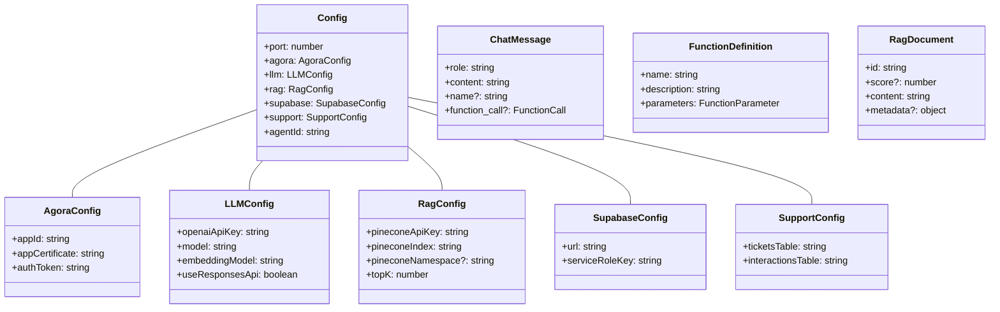

# Agora Convo AI Custom LLM Fastify

A Node.js based service layer that accepts incoming requests from the Agora Convo AI service and passes them to an AI model, allowing for RAG (Retrieval Augmented Generation) and tools integration.

## Description

This project implements a custom LLM-powered chat service using Fastify, OpenAI's API, to create a custom LLM for use in the Agora Convo AI Engine. It supports both streaming and non-streaming responses, function calling capabilities, and includes RAG (Retrieval Augmented Generation) functionality.

This project implements basic tools and a tool calling mechanism. The tools use Agora Signaling Service to send messages into a real-time messaging channel.

- Custom RAG (knowledge base)
- Function calling (tools)
- Streaming responses
- Support for both OpenAI's Chat Completions and Responses APIs

Built with Fastify for high performance and low overhead.

## Architecture


## Prerequisites

- Node.js v18 or later
- OpenAI API key
- Agora Convo AI account with app credentials

## Installation

1. Clone the repository

```bash
git clone https://github.com/yourusername/agora-convo-ai-custom-llm-fastify.git
cd agora-convo-ai-custom-llm-fastify
```

2. Install dependencies

```bash
npm install
```

3. Configure environment variables

```bash
cp env.example .env
```

Then edit the `.env` file with your API keys and configuration:

```env
AGORA_APP_ID=your_app_id
AGORA_APP_CERTIFICATE=your_certificate
AGORA_CUSTOMER_ID=your_customer_id
AGORA_CUSTOMER_SECRET=your_customer_secret
OPENAI_API_KEY=your_api_key
OPENAI_MODEL=your_model
AGENT_ID=your_agent_id
PORT=3000
USE_RESPONSES_API=false
```

## Running the Service

### Development

```bash
npm run dev
```

### Production

```bash
npm run build
npm start
```

## OpenAI Chat Completions & Responses API's

This server supports two different OpenAI API implementations:

1. **Chat Completions API** - The standard OpenAI chat completions endpoint
2. **Responses API** - OpenAI's new Responses API

For a detailed comparison of the two APIs, see the Open AI's [Responses vs Chat Completions](https://platform.openai.com/docs/guides/responses-vs-chat-completions) page.

You can switch between these APIs using the `USE_RESPONSES_API` environment variable:

```env
# Use Responses API
USE_RESPONSES_API=true

# Use Chat Completions API
USE_RESPONSES_API=false
```

Both APIs provide similar functionality but the Responses API offers improved performance because it emits semantic events detailing precisely what changed (e.g., specific text additions), so you can write integrations targeted at specific emitted events (e.g., text changes). Whereas the Chat Completions API continuously appends to the content field as tokens are generated—requiring you to manually track differences between each state.

## API Endpoints

This microservice is meant to be used as a drop-in with the Agora Convo AI service. It acts as a middleware application that accepts ASR text and processes it before sending it to OpenAI's servers.

### GET `/ping`

Returns a simple "pong" message to check the server's health.

Request:

```bash
curl http://localhost:3000/ping
```

Response:

```json
{ "message": "pong" }
```

### POST `/v1/chat/completion`

Processes chat messages and returns AI-generated responses.

**Request body:**

```json
{
  "messages": [
    {
      "role": "user",
      "content": "What is Agora?"
    }
  ],
  "model": "gpt-4o",
  "stream": false,
  "appId": "your-agora-app-id",
  "userId": "user123",
  "channel": "channel456"
}
```

Example Request:

```bash
curl -X POST http://localhost:3000/v1/chat/completion \
  -H "Authorization: Bearer <your-llm-api-key>" \
  -H "Content-Type: application/json" \
  -d '{"messages": [{"role": "user", "content": "Hello!"}]}'
```

To test the llm locally we recommend using the `ngrok` tool to expose your local server to the internet:

```bash
ngrok http localhost:3000
```

This will expose your local server to the internet and you can then use the ngrok url to test the llm.

**Response:**

- Non-streaming:

```json
{
  "id": "chatcmpl-123",
  "object": "chat.completion",
  "created": 1700000000,
  "model": "gpt-4o",
  "choices": [
    {
      "index": 0,
      "message": {
        "role": "assistant",
        "content": "Agora is the best realtime engagement platform."
      },
      "finish_reason": "stop"
    }
  ]
}
```

- Streaming: Server-sent events (SSE) with completion chunks

## Sequence Flow


## Available Tools

This service includes the following AI tools:

1. `fetch_customer_profile` – Look up the latest customer profile JSON by ID or email.
2. `fetch_recent_orders` – Return the most recent orders for a given customer (uses Supabase `orders`).
3. `create_support_ticket` – Persist a structured ticket in `support_tickets`, auto-linking customers/orders.
4. `update_ticket_status` – Change ticket status and optionally add internal notes (auto-logged as interactions).
5. `get_ticket_details` – Fetch ticket metadata plus the latest interaction notes for grounding.
6. `log_customer_interaction` – Append free-form notes/summaries to `support_interactions`.
7. `escalate_ticket` – Create an `escalations` row (and mark ticket escalated) for human takeover.
8. `log_change_event` – Insert an auditable change row into the `changes` table.
9. `record_agent_event` – Capture an agent decision record in `agent_events` (intent, sentiment, tasks, payload).

## Component Details

### 1. Server (`src/server.ts`)

- Main Fastify application entry point
- Configures middleware and plugins
- Mounts chat routes and health check endpoint

### 2. Chat Completion Router (`src/routes/chatCompletion.ts`)

- Handles POST requests to /v1/chat/completion
- Validates request parameters
- Manages both streaming and non-streaming responses

### 3. Authentication (`src/middleware/auth.ts`)

- Middleware for token-based authentication
- Validates Bearer tokens against configuration

### 4. OpenAI Service (`src/services/openaiService.ts`)

- Core chat completion processing
- Manages RAG integration
- Handles function calling
- Supports streaming and non-streaming modes

### 5. RAG Service (`src/services/ragService.ts`)

- Streams retrieval augmented generation data from Pinecone
- Generates embeddings with OpenAI before querying the vector store
- Provides a fallback knowledge base if no vectors are returned

### 6. Tools Service (`src/libs/tools.ts`)

- Implements function calling capabilities
- Reads/writes Supabase across customers, orders, tickets, interaction notes, escalations, change logs, and agent_events
- Optionally exposes Agora RTM helpers for outbound peer notifications
- Triggers escalation emails via SMTP (configurable through environment variables)

### 7. Tool Definitions (`src/libs/toolDefinitions.ts`)

- Defines available functions for LLM
- Specifies function parameters and schemas

## Customization

### Adding New Tools

To add a new tool, update the following files:

- `src/libs/toolDefinitions.ts` - Define the tool interface
- `src/libs/tools.ts` - Implement the tool functionality

### Modifying RAG Data

Update the `src/services/ragService.ts` file to tweak how Pinecone is queried (e.g., change namespace, metadata shaping, or fallback handling). You can also plug in an alternate vector store here if required.

## Data Models



## Environment Variables

- `PORT` - The port number (default: 3000)
- `OPENAI_API_KEY` - Your OpenAI API key
- `OPENAI_MODEL` - Default model to use (e.g., gpt-4o)
- `OPENAI_EMBEDDING_MODEL` - Embedding model used for Pinecone queries (default: text-embedding-3-small)
- `USE_RESPONSES_API` - Set to "true" to use OpenAI's Responses API instead of Chat Completions
- `PINECONE_API_KEY` - API key for your Pinecone project
- `PINECONE_INDEX` - Pinecone index name containing your vectors
- `PINECONE_NAMESPACE` - Pinecone namespace (optional)
- `PINECONE_TOP_K` - Number of documents to retrieve per query (default: 4)
- `SUPABASE_URL` - Supabase project URL
- `SUPABASE_SERVICE_ROLE_KEY` - Supabase service role key used for inserts/updates
- `SUPPORT_TICKETS_TABLE` - Table used to store support tickets (default: support_tickets)
- `SUPPORT_INTERACTIONS_TABLE` - Table used to store interaction notes (default: support_interactions)
- `SUPPORT_EMAIL` - Destination email address for escalation notifications (default: info@optivisx.com)
- `SMTP_HOST` / `SMTP_PORT` / `SMTP_USER` / `SMTP_PASS` - Optional SMTP credentials to enable escalation emails
- `AGORA_APP_ID` - Your Agora app ID
- `AGORA_APP_CERTIFICATE` - Your Agora app certificate
- `AGORA_CUSTOMER_ID` - Your Agora customer ID
- `AGORA_CUSTOMER_SECRET` - Your Agora customer secret
- `AGENT_ID` - Identifier for the AI agent

## Pinecone + Supabase Setup

1. **Pinecone**
   - Create/identify an index that stores your support knowledge base embeddings.
   - Populate each vector's metadata with at least a `text` or `title` + `source` field so the LLM can cite the content.
   - Add the Pinecone credentials (`PINECONE_API_KEY`, `PINECONE_INDEX`, optional namespace) to your `.env`.

2. **Supabase**
   - Create two tables (or reuse existing ones) and map their names with `SUPPORT_TICKETS_TABLE` and `SUPPORT_INTERACTIONS_TABLE`.
   - The tickets table should minimally include: `id`, `subject`, `description`, `customer_email`, `priority`, `status`, `channel`, `user_id`, `app_id`, `order_id`, timestamp columns, and optional metadata columns.
   - The interactions table should minimally include: `id`, `ticket_id`, `note`, `sentiment`, `channel`, `user_id`, `app_id`, and timestamps.
   - Store your Supabase service role key in `SUPABASE_SERVICE_ROLE_KEY` so the function calls can insert/update rows server-side.
   - Ensure the shared customer intelligence tables exist (see sample schemas you provided for `customers`, `orders`, `changes`, `escalations`, and `agent_events`) since the new tools read/write them directly.

## Optional Escalation Email Setup

If you want escalations to trigger an email:

1. Provide SMTP credentials via `SMTP_HOST`, `SMTP_PORT`, `SMTP_USER`, and `SMTP_PASS`. (Port 465 is treated as secure/SSL.)
2. Set `SUPPORT_EMAIL` to the inbox that should receive escalation alerts.
3. When configured, the `escalate_ticket` tool will automatically send a styled HTML summary (customer info, issue, conversation history, next steps) in addition to writing the Supabase record. Without SMTP credentials the call still succeeds but logs that email is disabled.

## Deployment

This project can be deployed to various platforms:

- Heroku
- Render
- Vercel
- Netlify
- Docker containers

See the corresponding configuration files in the repository for platform-specific setup.

## Quick Deploy

| Heroku                                                                                        | Netlify                                                                                                                                                                                       | Render                                                                                                                                                                              | Vercel                                                                                                                                                                 |
| --------------------------------------------------------------------------------------------- | --------------------------------------------------------------------------------------------------------------------------------------------------------------------------------------------- | ----------------------------------------------------------------------------------------------------------------------------------------------------------------------------------- | ---------------------------------------------------------------------------------------------------------------------------------------------------------------------- |
| [](https://heroku.com/deploy) | [](https://app.netlify.com/start/deploy?repository=https://github.com/AgoraIO-Community/agora-convo-ai-custom-llm-fastify) | [](https://render.com/deploy?repo=https://github.com/AgoraIO-Community/agora-convo-ai-custom-llm-fastify) | [](https://vercel.com/new/clone?repository-url=https://github.com/AgoraIO-Community/agora-convo-ai-custom-llm-fastify) |

Each platform requires the appropriate configuration:

- Heroku: Uses the [`app.json`](./heroku/app.json) file and [`Procfile`](./heroku/Procfile)
- Netlify: Uses the [`netlify.toml`](./netlify.toml) file and the Netlify function in [`netlify/functions/api.js`](./netlify/functions/api.js)
- Render: Uses the [`render.yaml`](./render.yaml) file
- Vercel: Uses the [`vercel.json`](./vercel.json) file

## License

MIT License
